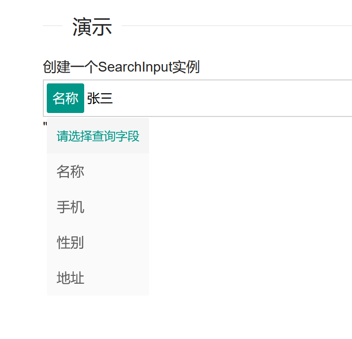

## Layui - searchInput 组件


### 简介

SearchInput 组件。是一个搜索组件，输入完成后按回车键(Enter)提示选择过滤字段！按回退键(Backspace)删除内容和字段标签


### 安装教程

下载下来放到Layui第三方扩展模块存放的基础目录, 如：/js/layui_exts/

### 使用说明

```js
layui.config({
  base: './js/layui_exts/'   // 配置Layui第三方扩展模块存放的基础目录
}).extend({
  searchInput: 'searchInput' // 扩展组件模块名
});

layui.use('searchInput', function() {
  var searchInput = layui.searchInput;
 
  var searchInst = searchInput.render({
    elem: '.search-tag-input', //搜索文本框选择器
    title: '请选择查询字段',
    data: [//初始值
      {field: 'name', name: '名称'},
      {field: 'phone', name: '手机'},
      {field: 'sex', name: '性别'},
      {field: 'address', name: '地址'}
    ],
    keyNum: {
      remove: 8, //删除按键编号 默认，BackSpace 键
      create: 13 //创建按键编号 默认，Enter 键
    },
    beforeCreate: function (data, value) {//选择标签前操作，必须返回字符串才有效
      console.log('beforeCreate', arguments);
      return value;
    },
    onChange: function (data, value, type) {
      console.log('onChange', arguments);
    }
  });
});
```

### 效果


